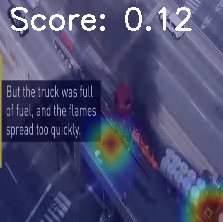
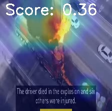
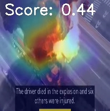
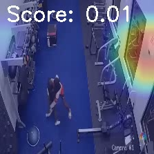
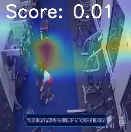
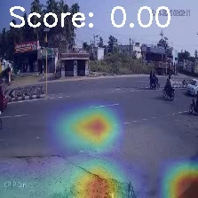
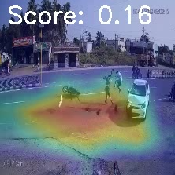
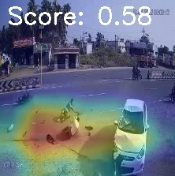

# Anomaly detection in surveillance videos using [UR-DMU](https://github.com/henrryzh1/UR-DMU.git)

Added some demo codes, and Grad Cam code too.

- Videos are split into fixed-size lengths (16 frames). To understand the overall structure: if a video has 529 frames, it can be divided into 33 full 16-frame segments (529//16), and the last segment will be padded by repeating the last frame to form 16 frames. This creates 34 segments of (1, 3, 16, 224, 224), which are then passed through a pre-trained I3D model to extract features, resulting in (1, 34, 1024). These features are then processed by an anomaly score prediction model, yielding (1, 34) anomaly scores. Each score is repeated 16 times to cover the original 529 frames.

- If oversampling is used (10-crop, provides more robust features because of flip), the video of 544 frames (15 repeated frames) is split into segments of [(10, 3, 16, 224, 224)]x34 where batch dimension represents 10-crop of each segment, resulting in features of shape (10, 34, 1024). The model processes oversampled data as a batch (1 * 10, 34, 1024), and the final output is averaged across the oversample dimension to give anomaly scores of shape (1, 34). These scores are then applied to the original 529 frames.

- The [Anomaly_detection_demo](Anomaly_detection_demo.py) code is using oversamplig method. Below scores are generated by taking every frame. This means each 16-frame segment or clip is created without even a single frame. Please look at the complete video in the [Out directory](feature_extract/Out/skip_frame_1).

  

  
 
  
 
  
 
- These scores below are generated by setting the skip frame by 5. This means every 5th frame is taken to prepare a segment containing 16 frames. The complete videos are available in the [Out directory](feature_extract/Out/skip_frame_5).

  

  
 
- As in the below fight, using every 5th frame reduces the number of anomaly frames in a segment so the probability decreases. But, it also reduces the score when the fight is not happening.

  

- Just a few frames of anomaly are hard to score. When skipping by 5, the number of frames in the segment that going to have anomaly frames is much less so the score goes down.

  

- Without oversampling means, the model needs (224, 224) cropped frames from a video. So, it may leave the anomaly or part of it. This score is generated by [AD_Vis](AD_Vis.py), without oversampling.

  

- In detail, [i3d_extract](feature_extract/i3d_extract.py) takes frames but need to save all [video's](feature_extract/Data/roadaccident) [frames](feature_extract/UCF_Crime_Frames/roadaccident) using [video2frame_split](feature_extract/video2frame_split.py) and convert to segments with oversampling and save as [.npy](feature_extract/UCF_ten/roadaccident_i3d.npy). After that [UR_DMU_demo](UR_DMU_demo.py) can be used to predict anomaly score.

- This [code](Grad_cam_demo.py) computes Grad-CAM (Gradient-weighted Class Activation Mapping) for video frames using an I3D model and an anomaly detection model. The video is divided into segments, each containing 16 frames, which are processed by the I3D model to extract features. These features are then passed to the anomaly model, which outputs anomaly scores for each frame. Gradients from the anomaly scores are back-propagated to the selected feature layer in the I3D model to generate the Grad-CAM heatmaps.
- For each video segment, the input is a tensor of shape (1, 3, 16, 224, 224), representing a batch of one video segment with 16 frames, each resized to 224x224 pixels and having 3 color channels. The Grad-CAM heatmaps are computed for each temporal frame (1,10,1,1024) and are upsampled to match the frame size, then overlaid on the original video frames to visualize which regions are most important for the anomaly detection task. Please see all results in the [Out directory](feature_extract\Out)

  

  

- May be [Grad_cam_demo.py](Grad_cam_demo.py) not working on fight because it is not taking all segments (1, no. of segments, 1024) once. So, it is not doing any temporal calculation. Temporal calculation is making scores comparative to each other to output high values for anomaly segments. [Grp_gradcam_demo.py](Grp_gradcam_demo.py) working well in temporal calculation but not giving heatmap correctly (* maybe it is implemented wrong).

  

  

## Requirements:
- Please check right version in [requirements.csv](requirements.csv)

## Contacts:
- borawarlokesh26@gmail.com

## Credits:
- [UR-DMU](https://github.com/henrryzh1/UR-DMU.git)
- Videos used for demonstration are:
  - [Abuse](https://www.youtube.com/watch?v=I2wiPj--3I8&t=1s)
  - [Explosion](https://www.youtube.com/watch?v=ILvLBjdv5LQ)
  - [Fight](https://www.youtube.com/watch?v=9FiIkT3WkWg&t=119s)
  - [Roadaccident](https://www.youtube.com/watch?v=46iWkLmZ4g8&rco=1)
